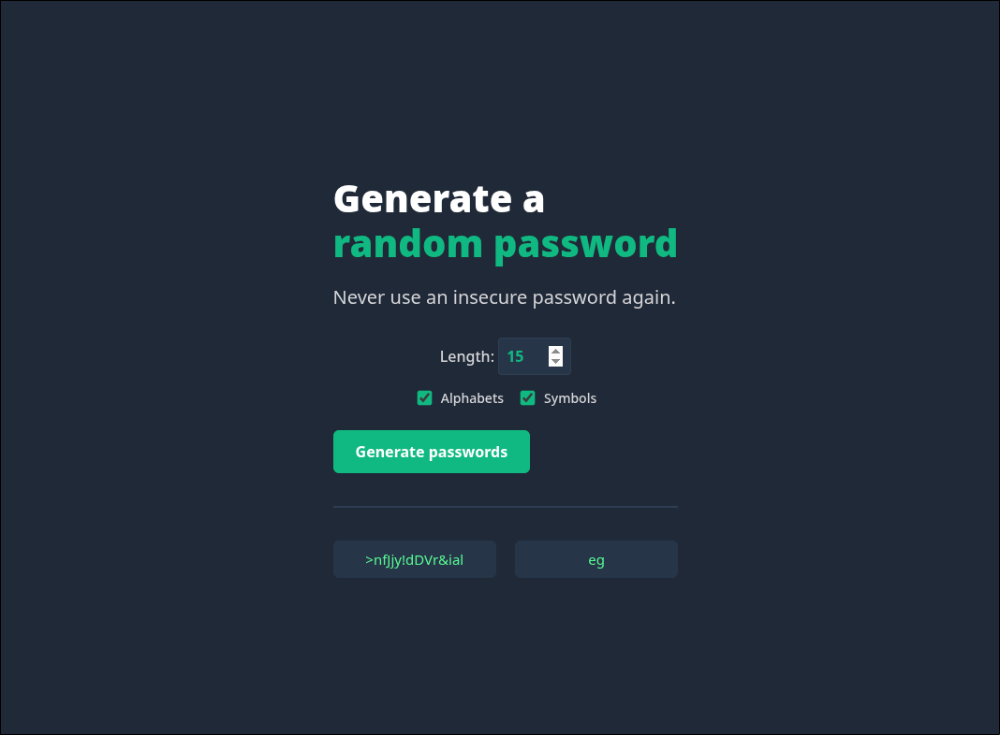

# 🔐 Random Password Generator

A simple and responsive **Random Password Generator** built with **HTML**, **CSS**, and **JavaScript**. It generates strong, secure, and random passwords with a clean and modern user interface.


---

## 📖 About

The **Random Password Generator** creates secure passwords instantly using JavaScript. It is designed to help users generate strong passwords for websites and applications, improving account security.

This project demonstrates JavaScript fundamentals such as DOM manipulation, event handling, random number generation, and clipboard functionality.

---

## ✨ Features

- 🔐 Generate secure random passwords
- ⚡ One-click password generation
- 📋 Copy password to clipboard
- 🎨 Clean and responsive interface
- 🚀 Fast and lightweight
- 💻 Works in all modern browsers

---

## 🛠️ Tech Stack

- HTML5
- CSS3
- JavaScript (ES6)

---

## 📂 Project Structure

```text
RandomPasswordGenerator/
│── pass.html
│── pass.css
│── pass.js
└── README.md
```

---

## 🚀 Getting Started

### Clone the repository

```bash
git clone https://github.com/mokshit510/RandomPasswordGenerator.git
```

### Navigate to the project

```bash
cd RandomPasswordGenerator
```

### Open the project

Simply open **pass.html** in your preferred web browser.

Or, if you're using **VS Code**, install the **Live Server** extension and click **Go Live**.

---
## 📸 Preview



---

## ⚙️ How It Works

1. Click the **Generate Password** button.
2. A strong random password is created.
3. Copy the password using the **Copy** button.
4. Paste it wherever you need a secure password.

---

## 📚 Concepts Practiced

- JavaScript DOM Manipulation
- Event Listeners
- Random Number Generation
- String Manipulation
- Clipboard API
- CSS Styling
- Responsive Design

---

## 🔒 Password Characteristics

Depending on your implementation, generated passwords may include:

- Uppercase Letters (A–Z)
- Lowercase Letters (a–z)
- Numbers (0–9)
- Special Characters (!@#$%^&*)

---

## 🔮 Future Improvements

- 🔢 Password length slider
- ☑️ Toggle uppercase, lowercase, numbers, and symbols
- 👁️ Show/Hide password
- 📊 Password strength indicator
- 🌙 Dark/Light mode
- 📝 Password history
- 🔄 Auto-generate on page load

---

## 🤝 Contributing

Contributions are welcome!

1. Fork the repository

2. Create a feature branch

```bash
git checkout -b feature-name
```

3. Commit your changes

```bash
git commit -m "Add new feature"
```

4. Push your branch

```bash
git push origin feature-name
```

5. Open a Pull Request

---

## 📄 License

This project is licensed under the **MIT License**.

---

## 👨‍💻 Author

**Mokshit Verma**

- GitHub: https://github.com/mokshit510
- LinkedIn: https://www.linkedin.com/in/mokshit-verma-136b55396/

---

⭐ If you found this project useful, don't forget to **star the repository!**